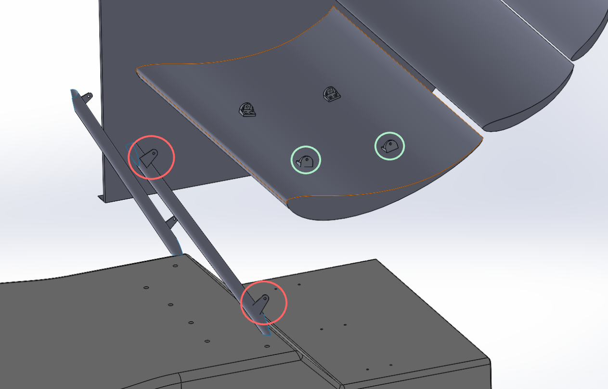

# Topology Optimization Guide
This guide is meant to be a step-by-step(ish) description of the general process that was used to design the front and rear wing mounts on fb25. 
My goal while writing this is to make it as generalized as possible so it can be applied to design applications outside of just aero wing mounts. 
The workflow is definitely not optimized either, so I encourage people to look for ways to potentially improve it. 

## Step One: Defining your support points
Before you begin designing your part, you first need to determine what the part is actually going to attach to. Using the rear wing as an example, we clearly need to design the mount to 
span from the two attachment points on the wing to the two brackets on the roll hoop.

(insert formatted image of the rear wing with pauls balls mounts circled in green and rollhoop mounts in red)

## Step Two: Defining Your Maximum Material Area
The ansys structural optimization method that we will be using (Density Based Topology Optimization) works by determining the lowest possible material density in each cell of the part we are optimizing, to meet a certain load case and set of criteria (in very oversimplified terms). This means we will first need to give the software a large solid part to work with, as this optimization method can optimize material that alread exists in the part. In the case of most 2d plates like this, the best way to define the starting material is to create the outline of what you want your final plate to look like. I encourage you to briefely skim through the ansys documentation [here](https://ansyshelp.ansys.com/public/account/secured?returnurl=/Views/Secured/corp/v251/en/mech_struct_opt/ds_topo_opt_limitations.html) to learn a bit more about how this methodology works.  

<figure>
  
  <figcaption>First identify your mounting points</figcaption>
</figure>  
<figure> 
  
  <figcaption>Example of a plate outline (watch out interferences and the height limit!)</figcaption>
</figure>  
<figure>
  Create your outline part in solidworks</figcaption>
</figure>  

Note: It is important in this step to keep in mind the design rules and watch out for interferences. Make sure your plate doesn't interfere with any rear wing elements and isn't so tall as to become illigal via the rules. See [T 7.7](https://www.bing.com/ck/a?!&&p=31d652aacf2c253635ddbf2cef5e78a2e902b9649fdfdee165f7b8406cfcdb3bJmltdHM9MTc3MTM3MjgwMA&ptn=3&ver=2&hsh=4&fclid=10275a2f-76f2-6c6c-0dac-4d2b77e96d8c&psq=fsae+2026+ev+rulebook&u=a1aHR0cHM6Ly93d3cuZnNhZW9ubGluZS5jb20vY2Rzd2ViL2dlbi9Eb3dubG9hZERvY3VtZW50LmFzcHg_RG9jdW1lbnRJRD0yNzhmZDRkNy1hYTI3LTRlMzMtYmM0YS0wOTAxNDhlNjYyYTA) on page 71 of the rulebook for aerodynamic devices, specifically the height limit.   

## Step Three: Initial Static Structural Simulation
In order to run the topology optimization program, we first need to run a static structural simulation on our part using the expected load cases.

# First, open Ansys Workbench and create a static structural simulation

# Define the material of the part
Here we come to a bit of an issue. The parts that we are designing to go on the car will be made of aluminum 7075T6, however when I designed these parts last year, I vaguely remember being advised to run the optimization program using structural steel instead of aluminum 7075. I believe it was because the optimization method we are using doesn't work very well with aluminum, but I cannot confirm this and haven't actually compared the results using each material. It may be true, or it may be some urban legend passed down through generations - if someone wants to run the same simulation in parallel with aluminum and steel to test that out, that would be really cool! For the guide i'm just going to say to use steel because I did it last year and it worked well enough. 

Note: You may come to find that the material is already assigned as structural steel by default, in which case you don't need to do anything!

# Add loads and constraints
For the sake of this guide, i'm just adding generalized forces. When you do this project for real, you should be provided with loads by Sam and Viktor. 

Note: Make sure to apply a different bearing load for each hole, or the force you specify will be distributed over the multiple holes selected
Note 2: Hold Ctrl to select multiple faces at a time

# Create your mesh

# Define your analysis Outputs

<!-- "S:\CAR\SP\Formula\Car 25 Vehicle (EV)\Car 25 Vehicle CAD\Aerodynamics\RW\Swan Neck\pald testing\Iteration 1\swan-neck-fea.wbpj" 
-->
